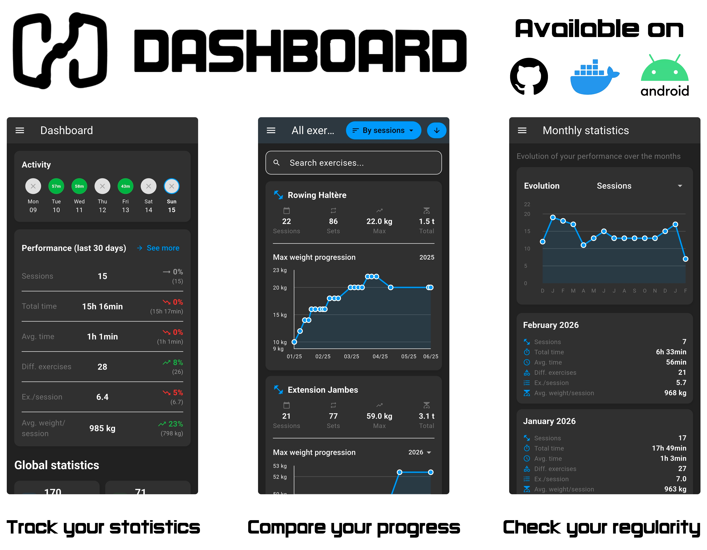

# Hevy Dashboard

Hevy Dashboard is a Flutter app that turns your Hevy workout exports into a clean, interactive statistics dashboard. Import your Hevy CSV and explore your training history, trends, and progress in one place.

## Features

- Import Hevy CSV exports
- Global training stats (sessions, total weight, sets, etc.)
- Exercise-level charts and progress tracking
- Monthly overview and performance comparisons
- Responsive layout (mobile and web)

## Screens

The app focuses on three areas:

- Dashboard overview
- Exercise analytics
- Monthly statistics

## Download

- **Android (Play Store):** https://play.google.com/store/apps/details?id=arbitro.android.hevy_dashboard_app
- **Web (Docker Hub image):** https://hub.docker.com/r/eideme/hevy-dashboard-app

For the web version, hosting remains your responsibility.

## License

MIT License. See [LICENSE](LICENSE).
